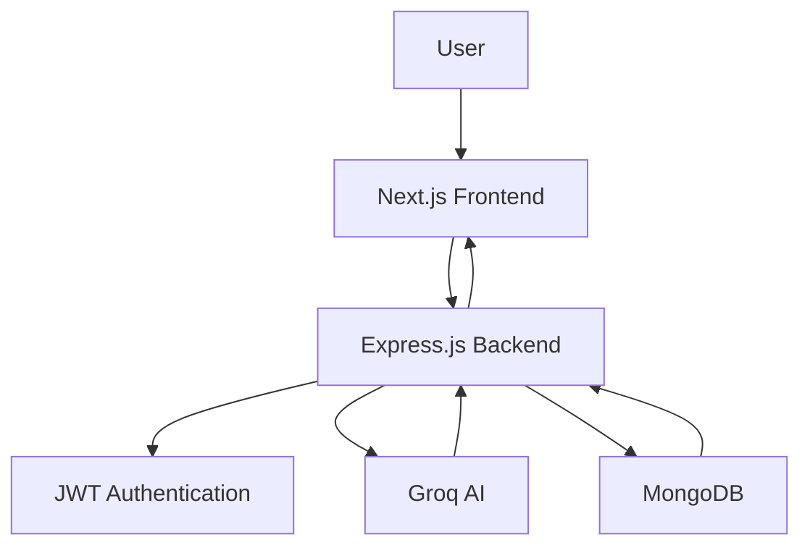

# 🚀 CareerPilot AI

CareerPilot AI is an AI-powered career development platform that helps users analyze resumes, discover skill gaps, generate personalized career roadmaps, and receive intelligent career guidance using **Groq AI (Llama 3.3 70B)**.

---

## 🌐 Live Demo

### Frontend

https://careerpilot-ai-web-zeta.vercel.app

### Backend API

https://careerpilot-ai-server-blond.vercel.app

---

# 📸 Project Screenshots

## 🏠 Home


---

## 📊 Dashboard


---

## 📄 Resume Analyzer


---

## 🎯 Explore Career


---

## 💬 AI Career Chat


---

# 🏗 Architecture



---

# ✨ Features

- 🔐 Secure JWT Authentication
- 📄 AI Resume Analyzer
- 📊 ATS Resume Score
- 🎯 Career Recommendation Engine
- 🧠 Skill Gap Detection
- 🛣 Personalized Career Roadmap
- 💬 AI Career Chat Assistant
- 📚 Resume History
- 📝 Chat Conversation History
- ⚡ Groq AI Integration
- 🗄 MongoDB Database
- 🌐 RESTful API
- 📱 Responsive Design

---

# 🛠 Tech Stack

## Frontend

- Next.js
- React
- TypeScript
- Tailwind CSS

## Backend

- Node.js
- Express.js
- TypeScript

## Database

- MongoDB
- Mongoose

## Authentication

- JWT

## AI

- Groq AI
- Llama 3.3 70B Versatile

---

# 📂 Project Structure

```text
careerpilot-ai-web/

├── app/
├── components/
├── context/
├── lib/
├── types/
├── assets/
│   └── screenshots/
├── public/
└── README.md
```

---

# 🚀 Getting Started

## Clone Repository

```bash
git clone https://github.com/Mdnayem097/careerpilot-ai-web
```

## Install Dependencies

```bash
npm install
```

## Environment Variables

Create a `.env.local` file.

```env
NEXT_PUBLIC_API_URL=http://localhost:5000/api/v1
```

## Run Development Server

```bash
npm run dev
```

## Build

```bash
npm run build
```

## Production

```bash
npm start
```

---

# 📡 Backend API

Authentication

- POST `/api/v1/auth/register`
- POST `/api/v1/auth/login`
- GET `/api/v1/auth/me`

AI

- POST `/api/v1/ai/resume-analyzer`
- POST `/api/v1/ai/career-recommendation`
- POST `/api/v1/ai/chat/message`
- GET `/api/v1/ai/resumes`
- GET `/api/v1/ai/roadmaps`
- GET `/api/v1/ai/chat/conversations`

---

# 🤖 AI Capabilities

- Resume Analysis
- ATS Optimization
- Skill Gap Detection
- Personalized Career Recommendation
- Career Roadmap Generation
- AI Career Chat Assistant

---

# 🔮 Future Improvements

- Resume PDF Upload
- Streaming AI Responses
- AI Interview Preparation
- Company Recommendation
- Email Notifications
- Docker Deployment
- CI/CD Pipeline
- Admin Dashboard

---

# 👨‍💻 Author

**MD Nayem**

- 🌐 Portfolio: https://md-nayem-portfolio.vercel.app
- 💼 LinkedIn: https://linkedin.com/in/md-nayem-swe
- 💻 GitHub: https://github.com/Mdnayem097

---

## ⭐ Support

If you found this project useful, please consider giving it a ⭐ on GitHub.

Your support helps improve the project and motivates future development.